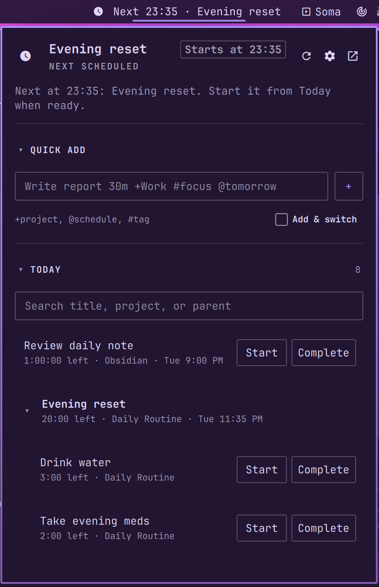
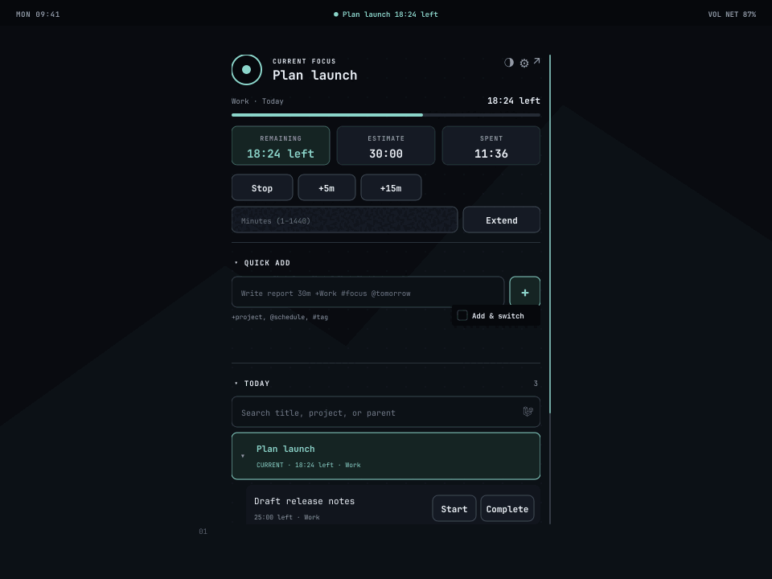

# Super Productivity for Omarchy

Show and control the current [Super Productivity](https://super-productivity.com/) task from the Omarchy top bar.

## Features

- Shows the current task with a local second-by-second countdown and signed overtime.
- Shows the next scheduled task and local start time in the idle bar and panel.
- Stops, completes, and extends the current task with explicit controls.
- Lists incomplete Today tasks as chronological parent blocks. Scheduled blocks sort by ascending start time, unscheduled blocks follow, each parent's child order is authoritative, and orphaned children become top-level rows.
- Gives runnable Today leaves explicit **Start** and **Complete** controls. Parents never show **Complete**.
- Completes tasks from Today without opening Super Productivity.
- Adds a task without switching, or adds it and switches once, through one compact persistent inline checkbox.
- Alerts once when a countdown expires or a scheduled task reaches its start time, whether idle or tracking.
- Tests notifications and previews alert sounds. Panel previews use the displayed volume; IPC previews use the configured volume.
- Opens or focuses the Super Productivity desktop app.
- Keeps one polling and mutation service across all monitors.

## Preview



The screenshot above is a cropped live capture. The generated preview below demonstrates additional states without using private task data.



The animated preview uses synthetic task and project names. The static [reduced-motion preview](assets/screenshots/panel-reduced-motion.png) shows the synthetic idle next-start state.

## Requirements

- Omarchy with the shell plugin system.
- Super Productivity desktop app with its local REST API enabled.
- Python 3.10 or later.
- A direct REST API token environment override, or a private regular token file owned by your user with no group or world permissions. Mode `0600` is recommended.

The open action tries `hyprctl`, `gtk-launch`, and `xdg-open`, in that order.

## Install

Enable the local REST API in **Super Productivity → Settings → Misc**. Super Productivity creates the token file when you enable the API.

Install and enable the plugin:

```bash
omarchy plugin add https://github.com/patrickfanella/omarchy-superproductivity.git --enable
```

If the widget does not appear, refresh plugin discovery:

```bash
omarchy-shell shell rescanPlugins
```

## Use the panel

Left-click the bar widget, or run the official shell panel command:

```bash
omarchy-shell shell toggle patrickfanella.superproductivity '{}'
```

Press <kbd>Escape</kbd> to close the panel.

### Bar controls

| Control | Result |
| --- | --- |
| Left-click | Open or close the panel |
| Middle-click | Refresh status |
| Right-click | Focus or open Super Productivity |

### Current-task controls

- **Stop** stops tracking the current task.
- **Complete** completes a current leaf task. A current parent never shows this control. Complete its children in the order you choose. Super Productivity manages the parent.
- **+5m** and **+15m** increase the estimate.
- The custom **Extend** control accepts a whole number from 1 through 1440. Enter in its minutes field also extends the task.

All mutation controls are disabled while another mutation is queued or running.

The top-right gear opens the in-plugin configuration view. The adjacent controls refresh status and open Super Productivity.

### Quick Add controls

Quick Add appears above Today. Its compact, borderless **Add & switch** checkbox sits beside the syntax hint. It persists as `quickAddSwitch` and defaults to off. Both Enter in the field and the square **+** button obey it. When checked, either action creates the task and then tries one switch. When unchecked, either action only creates the task. Keyboard focus uses a tinted background and underline.

The panel shows the exact hint `+project, @schedule, #tag`.

Quick Add supports these forms:

```text
Write report 30m
Plan launch t1h 30m +Work
Review draft 15m/1h #focus @tomorrow
Clear inbox 30m/ @2026-08-28
```

- `30m`, `1.5h`, or `1h 30m` sets the estimate.
- `15m/1h` sets spent time and the estimate.
- `30m/` sets spent time only.
- `+Project` selects an existing project. Put the project at the end, before any schedule hint.
- `#tag` selects an existing tag. Tag matching ignores letter case.
- `@schedule` represents `@today`, `@tomorrow`, `@YYYY-MM-DD`, or a weekday. Each form sets the due day.

Unknown or ambiguous projects and unknown tags produce an error. The plugin does not create projects or tags. Tasks without `+Project` go to the Super Productivity Inbox.

### Today controls

Today appears below Quick Add. It contains incomplete top-level tasks and their direct subtasks. Each parent and its children form one block. Blocks with scheduled start times sort chronologically, then unscheduled blocks retain their source order. Children retain the order in the parent's `subTaskIds`. A child whose parent block is unavailable appears as a top-level row.

Parent rows expand and collapse. Click a parent row, or press Enter or Space while it has focus, to toggle its children. A search temporarily reveals the parent of a matching child without changing the saved collapse state.

Each runnable leaf row has explicit **Start** and **Complete** controls. Parents have neither action. Click a parent's title or context area to toggle its children. Click a runnable leaf's title or context area to start it. This makes the chronological Today list work like a calendar agenda: scan by time, then activate the task text. Button hit areas do not overlap the text area, so one click sends one action.

The current leaf row's **Complete** control uses current-task completion and follows **Start next after Complete**. A noncurrent leaf uses targeted list completion and never starts another task. A task with retained `subTaskIds` is always a parent, even when every child is done. It has no **Complete** control. Pressing <kbd>C</kbd> on it reports `Complete subtasks first; Super Productivity manages the parent.` and sends no mutation.

Completion reports the mutation result in the panel. After a successful list completion, focus moves to the next row, then the previous row if no next row remains. If no rows remain, focus moves to Today search. A failed completion restores focus to the same row.

Parents with children are not runnable from the panel. Start an explicit child instead. Super Productivity can map a direct backend start of a parent to its first unfinished child.

The floating **Go top** control appears after you scroll down. It scrolls to the top and focuses Quick Add, or the first visible header control when Quick Add is collapsed. In settings, it focuses **Back**. <kbd>Home</kbd> performs the same action unless a text field owns the key.

## Keyboard controls

### Task view

| Key | Result |
| --- | --- |
| Open the panel | Focuses the current Today row when visible, otherwise the first Today row. If Today has no row, focus stays on the panel. |
| <kbd>Tab</kbd> / <kbd>Shift</kbd>+<kbd>Tab</kbd> | Moves through every enabled panel control. At an edge, focus can move to the adjacent bar panel. |
| <kbd>↑</kbd> / <kbd>↓</kbd> or <kbd>K</kbd> / <kbd>J</kbd> | Moves between Today rows when a row or one of its controls has focus. |
| <kbd>Enter</kbd> / <kbd>Space</kbd> | Activates the focused non-text control. On a Today parent row, toggles its children. On a runnable leaf row, starts it. |
| <kbd>C</kbd> | Completes the focused leaf. On a parent it reports that subtasks must be completed first and sends no mutation. It does nothing outside Today row focus. |
| <kbd>/</kbd> | Outside a text field, expands Today and focuses its search field. |
| <kbd>Home</kbd> | Runs **Go top** unless a text field owns the key. |
| <kbd>Escape</kbd> | Closes the panel from any control. |

Text fields own normal typing and editing shortcuts. Enter in Quick Add submits according to **Add & switch**. Enter in the minutes field applies the extension.

### Settings view

| Key or control | Result |
| --- | --- |
| Open settings | Focuses **Back**. |
| <kbd>Tab</kbd> / <kbd>Shift</kbd>+<kbd>Tab</kbd> | Moves through **Back**, every setting control, notification test, and sound preview. |
| <kbd>Enter</kbd> / <kbd>Space</kbd> | Activates the focused button, toggle, or choice. Enter applies a focused number or text field. |
| <kbd>Home</kbd> | Scrolls to the top and focuses **Back**, unless a text field owns the key. |
| **Back** or <kbd>Escape</kbd> | Returns to the task view. A second <kbd>Escape</kbd> closes the panel. |

Text fields keep their typing and editing shortcuts. Today row movement, <kbd>C</kbd>, and <kbd>/</kbd> do not run in settings.

## Optional global hotkey

The plugin never edits your bindings. To add a global hotkey, first run `hyprctl binds` and choose an unused combination. `SUPER + SHIFT + U` is a current unused example:

```lua
o.bind("SUPER + SHIFT + U", "Super Productivity", "omarchy-shell shell toggle patrickfanella.superproductivity '{}'")
```

Add the line manually to `~/.config/hypr/bindings.lua`, then apply and check the configuration:

```bash
hyprctl reload
hyprctl configerrors
```

`SUPER + SHIFT + T` is commonly, and currently, used for Super Productivity Quick Add, so this plugin does not select it. To uninstall the hotkey, remove the `o.bind` line and run the two validation commands again.

## Test alerts

Open the in-plugin configuration view with the top-right gear to configure task alerts, send a test notification, or preview the alert sound. The alert toggle, sound toggle, volume, sound path, and urgency apply to both countdown expiry and scheduled start. A panel preview snapshots the displayed volume. An IPC preview snapshots the configured volume. Notification and sound tests are also available through the [backend CLI](#backend-cli) and [IPC](#ipc).

The notification test sends the synthetic text `Notification test` at the configured urgency. It does not use a task title. Sound preview plays the configured sound without sending a notification.

## Time and expiry behavior

The backend reports `signedRemainingMs = timeEstimate - timeSpent`. The service subtracts transport age and local elapsed time. Positive values display as remaining time. Negative values display as overtime in `+M:SS` form. Overtime does not rewrite tracked time.

A task with a zero estimate displays **No estimate**. It never enters overtime and never sends an expiry alert.

The bar can reach zero between polls, but that local transition only requests a refresh. The service alerts after a fresh API response confirms that the same estimated task crossed from positive time to zero or less. It sends one alert for that confirmed crossing. A task first observed after expiry does not alert. If confirmed time later becomes positive, the task arms again and can alert on a later confirmed crossing.

While idle, the bar shows `Next HH:mm · <title>` for the next scheduled Today task. The time uses the local timezone. The panel repeats the full title and start time. Connection errors still take priority.

Scheduled-start alerts use each fresh Today sample. When scheduled tasks cross their start time, the service records every crossing and alerts for the earliest one that is not already current. It also suppresses a scheduled parent when Super Productivity reports one of its children as current. Tracking any unrelated task does not suppress the alert. If several tasks cross together, a current task does not prevent the earliest unrelated crossing from alerting. On first startup, the service records the current schedule without alerting for old start times. Recovery after an interrupted or failed refresh is best effort. **Task alerts**, **Play alert sound**, **Alert volume**, **Alert sound path**, and **Notification urgency** are shared by countdown-expiry and scheduled-start alerts.

## Configure the widget

Select the top-right gear in the popup to open the **Super Productivity** configuration view. The plugin renders this view in its popup instead of using the Omarchy Shell Settings panel. Setting changes persist through the plugin registry and shell configuration.

| Setting | Default | Accepted values | Effect |
| --- | ---: | --- | --- |
| Status refresh | 5 seconds | 2–30 seconds | Sets the interval between helper status requests. |
| Maximum bar width | 300 px | 120–520 px | Limits the task label width. |
| Show while idle | On | On or off | Keeps the generic idle marker in the bar. A known next scheduled task remains visible. |
| Task alerts | On | On or off | Enables countdown-expiry and scheduled-start alerts, including while tracking. |
| Play alert sound | On | On or off | Plays a sound for both task alert types. |
| Alert volume | 100% | 0–100% in steps of 5 | Sets playback volume for both task alert types and sound previews. 0 is muted. |
| Alert sound path | Blank | Local path or blank | Selects the sound for both task alert types. Blank selects `assets/timer-complete.wav`. |
| Notification urgency | Critical | `low`, `normal`, or `critical` | Applies to both task alert types and test notifications. |
| Start next after Complete | Off | On or off | Applies only to completion requested by this plugin. |
| Auto-next schedule window | 30 minutes | 1–1440 minutes, step 5 | Only scheduled tasks whose finite start time is within ±window are eligible. |
| Add & switch | Off | On or off | When on, Enter and the inline **+** create the task and switch to it. |

Auto-next scans the next sibling first, then the remaining flattened Today order. It skips unscheduled tasks, tasks with invalid start times, scheduled tasks outside the configured ±window, done tasks, every parent with retained `subTaskIds`, and the completed task. The default window is 30 minutes. It never wraps to the start.

After completion, the helper allows the current task to be null or the completed task's exact captured parent during the 300 ms grace period. It rechecks immediately before its single follow-up POST. An unrelated current task always wins and is never changed. If Super Productivity promotes the exact parent and no eligible auto-next candidate remains, the helper rechecks the parent and sends one untargeted Stop to undo that promotion, even when auto-next is disabled. Because Stop cannot name its target, another client can still switch tasks after the last read but before Stop is applied; this residual race cannot be eliminated by the local API.

## Mutation results and race limits

Super Productivity does not provide transactions or revision guards for these operations. The helper serializes its own mutations, sends each mutation at most once, and verifies observable postconditions. It never retries or rolls back a mutation automatically.

Each mutation result has a `state` and `stage`:

| State | Meaning |
| --- | --- |
| `succeeded` | The observed postconditions matched. |
| `partial` | The primary mutation applied, but a postcondition or follow-up did not match. |
| `conflict` | A preflight check found changed or unsafe state. No mutation was sent. |
| `failed` | The request is known not to have applied. |
| `unknown` | A dispatched request may have applied, but the helper could not determine the result. |

Stages are `queue`, `validation`, `preflight`, `dispatch`, `verify`, `followup-preflight`, `followup-dispatch`, `followup-verify`, and `done`. `mutationApplied` and `followupMutationApplied` are `true`, `false`, or `null` when the result is unknowable. No follow-up runs after an unknown primary result.

The helper checks the expected current-task ID before Stop, Complete, and Extend. Stop remains best effort because Super Productivity's stop endpoint does not accept a task ID. Extend reads an estimate and then writes an absolute value. A concurrent estimate edit can therefore be lost or detected only during readback.

Completion never cascades to subtasks. Both completion commands reject any task with retained `subTaskIds`, regardless of child completion state. Current-task completion also rechecks the current ID immediately before its completion PATCH. The panel guard is only an early UI check.

**Add & switch** is a compound operation. If creation succeeds but the current task changes or the switch fails, the created task remains and the result is `partial`. Creation is never retried.

The private helper lock serializes this plugin's service and direct CLI mutations. It cannot serialize the Super Productivity UI or unrelated API clients. Success means that readback matched at that point, not that another client could not change state immediately afterward.

## Backend CLI

Run the helper from the repository root. Every command prints one compact JSON object. Mutation commands exit zero only for `succeeded`.

```text
backend/superproductivity.py status
backend/superproductivity.py add <shorthand> [--start]
backend/superproductivity.py start <task-id>
backend/superproductivity.py stop <expected-current-id>
backend/superproductivity.py complete <task-id> [--auto-next [--auto-next-window <1-1440>]]
backend/superproductivity.py complete-task <task-id>
backend/superproductivity.py extend <task-id> <whole-minutes>
backend/superproductivity.py test-notification --urgency <low|normal|critical>
backend/superproductivity.py preview-sound [--sound <path>] [--volume <0-100>]
backend/superproductivity.py alert --urgency <low|normal|critical> [--sound <path>|--silent] [--volume <0-100>] -- <title>
backend/superproductivity.py show
```

`complete` completes the expected current leaf and optionally runs auto-next. `--auto-next-window` defaults to 30 and limits scheduled candidates to ±that many minutes. Use it with `--auto-next`. `complete-task` completes the named listed leaf without auto-next and does not require it to be current. Both commands reject every task with retained `subTaskIds`. `start` reports both the requested ID and the actual current ID. `extend` accepts 1 through 1440 minutes, and the resulting estimate cannot exceed 365 days. `--volume` accepts 0 through 100 and defaults to 100 for `preview-sound` and `alert`. `alert` is the real expiry path. Its `--` delimiter keeps a title from being parsed as an option.

## IPC

The target is `patrickfanella.superproductivity`. Use the Omarchy shell IPC form shown by your installed Omarchy version. The handler exposes these commands:

```text
open()
close()
toggle()
refresh()
show()
status()
start(id)
stop(expectedId)
complete(id)
completeTask(id)
extend(id, minutes)
add(shorthand, startAfter)
testNotification()
previewSound()
action(requestId)
```

IPC arguments arrive as strings. `add` accepts `startAfter` as `true`, `false`, `1`, or `0`. An empty value uses the persisted `quickAddSwitch` setting, which defaults to off. `complete(id)` performs current-task completion and uses the configured `autoStartNext` value. `completeTask(id)` performs targeted list completion and never runs auto-next.

Mutating commands return `{"accepted":true,"requestId":"<service-start-ms>-<counter>"}` or `{"accepted":false,"error":"<code>"}`. Acceptance means queued, not applied. Poll `action(requestId)` until `queueState` is `finished`:

```json
{"found":true,"requestId":"...","queueState":"queued"}
{"found":true,"requestId":"...","queueState":"running"}
{"found":true,"requestId":"...","queueState":"finished","result":{"state":"succeeded","stage":"done"}}
```

An unknown or expired ID returns `{"found":false}`. The queue holds 16 pending requests plus one running request. A queued request expires before dispatch after 30 seconds. The service retains the newest 64 finished results for 10 minutes and forgets all results on restart.

`refresh`, `show`, `testNotification`, and `previewSound` do not use the mutation queue. Notification tests reject concurrent tests. IPC `previewSound()` snapshots the configured volume. Panel previews snapshot the displayed volume when queued. Each preview keeps that value even if configuration changes before playback. Invalid explicit preview volumes are rejected. Alerts always read the configured volume when launched. Sound preview uses a separate FIFO lane.

## Environment overrides

| Variable | Purpose |
| --- | --- |
| `SUPERPRODUCTIVITY_API_URL` | Preferred local API URL override. |
| `SUPER_PRODUCTIVITY_REST_URL` | API URL alias. |
| `SP_LOCAL_REST_URL` | API URL alias. |
| `SUPER_PRODUCTIVITY_URL` | API URL alias. |
| `SUPER_PRODUCTIVITY_TOKEN_FILE` | Path to a private, user-owned token file. |
| `SP_LOCAL_REST_TOKEN` | Direct token override. Takes precedence over token files. |
| `SUPER_PRODUCTIVITY_TOKEN` | Direct token alias. |
| `SUPER_PRODUCTIVITY_APP_URL` | URI for the final `xdg-open` fallback. |

API URLs must use `http` or `https`, have no credentials, query, or fragment, and use exactly `localhost`, `127.0.0.1`, or `::1`. The default is `http://127.0.0.1:3876`.

The helper checks these token paths in order:

```text
~/.config/superProductivity/local-rest-api-token
~/.var/app/com.super_productivity.SuperProductivity/config/superProductivity/local-rest-api-token
~/snap/superproductivity/common/.config/superProductivity/local-rest-api-token
~/snap/superproductivity/current/.config/superProductivity/local-rest-api-token
```

If you use `--user-data-dir` or another custom location, set `SUPER_PRODUCTIVITY_TOKEN_FILE` in the environment that starts `omarchy-shell`. Prefer a token file because environment variables can be visible to child processes and diagnostics.

## Sound limits

Custom sounds must meet all of these conditions:

- The resolved path is under your home directory or `/usr/share/sounds`.
- The path is a readable regular file no larger than 20 MiB.
- The suffix is `.wav`, `.ogg`, `.oga`, `.flac`, or `.mp3`.

The bundled `assets/timer-complete.wav` is also accepted. Playback tries `pw-play`, `paplay`, and `canberra-gtk-play`, in that order. The `canberra-gtk-play` fallback receives its volume as a decibel value. Real alert playback has a 60-second timeout.

A preview stops after three seconds. The helper starts the player in a new process group. On cancellation it sends SIGTERM, waits 200 ms, then sends SIGKILL and reaps the process. A real alert clears queued previews, cancels an active preview, and waits at most 500 ms for its exit before forcing cleanup and continuing.

## Security and privacy

Omarchy plugins run unsandboxed inside `omarchy-shell`. This plugin starts its bundled Python helper, sends authenticated requests to the configured loopback address, and starts local desktop commands for notifications, sound, and app focus.

The helper disables HTTP proxies and rejects redirects. A direct token environment override is accepted. Otherwise, the token path must be a regular file owned by your user with no group or world permission bits. Mode `0600` is recommended, but any owner permissions that keep all group and world bits clear are accepted. The helper opens token and lock files without following symlinks and passes subprocess arguments as arrays without a shell. The mutation lock lives in a private `$XDG_RUNTIME_DIR` directory, or a private per-user directory under `/tmp` when that variable is unavailable.

Loopback HTTP does not authenticate the listening process. While Super Productivity is not listening, another trusted local account could bind the same port and receive the token on the next request. See [Security policy](SECURITY.md) for the full boundary.

`status`, mutation results, and API errors can contain task titles, task IDs, project names, dates, and other work data. Remove those values before sharing logs. Never share the token or an `Authorization` header.

## Troubleshoot

Check the API and token permissions:

```bash
curl http://127.0.0.1:3876/health
stat -c '%a %U:%G %n' ~/.config/superProductivity/local-rest-api-token
chmod 600 ~/.config/superProductivity/local-rest-api-token
```

Check the helper and plugin:

```bash
backend/superproductivity.py status
omarchy plugin validate .
omarchy-shell patrickfanella.superproductivity status
```

If the helper reports a connection error, open Super Productivity and confirm that the local REST API is enabled.

## Remove

```bash
omarchy plugin remove patrickfanella.superproductivity
```

Removal deletes only the plugin checkout. It does not change Super Productivity data, settings, or tokens.

## Develop

Run all checks from the repository root:

```bash
python3 scripts/verify_release_files.py
PYTHONDONTWRITEBYTECODE=1 python3 -m unittest tests/test_backend.py tests/test_phase1_backend.py tests/test_preview_assets.py
node --test tests/*.test.js
PYTHONDONTWRITEBYTECODE=1 python3 -m py_compile backend/superproductivity.py
omarchy plugin validate .
qmllint -I /usr/share/omarchy/shell BarWidget.qml Panel.qml Service.qml
python3 scripts/generate_default_sound.py
git diff --exit-code -- assets/timer-complete.wav
python3 scripts/generate_preview_assets.py
git diff --exit-code -- assets/demo.gif assets/preview-src assets/screenshots
```

The final commands prove that the committed sound and synthetic previews match their generators.

## License

[MIT](LICENSE)
